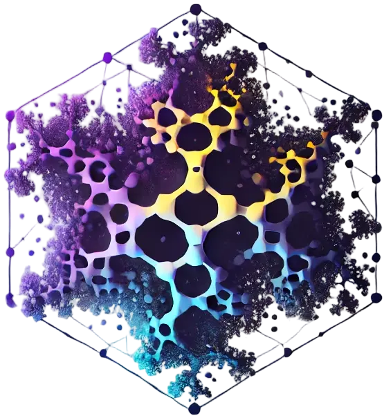

# Welcome to pyfracval's documentation!



PyFracVAL generates fractal-like aggregates... (add a brief description)

```{toctree}
:maxdepth: 2
:caption: Contents:

installation
usage
references
```
