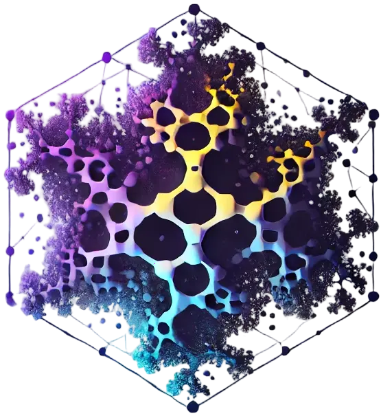

# Welcome to pyfracval's documentation!



PyFracVAL generates 3D fractal-like aggregates of mono- and polydisperse primary particles using a PCA→CCA strategy. The implementation follows the FracVAL algorithm {cite:p}`Moran2019FracVAL` and related fractal morphology literature {cite:p}`Filippov2000Tunable`.

```{toctree}
:maxdepth: 2
:caption: Contents:

installation
usage
experiments
pairing_frustration
hard_regime_boundary_sweep
full_thesis_replication_sweep
gpu_acceleration
references
```
